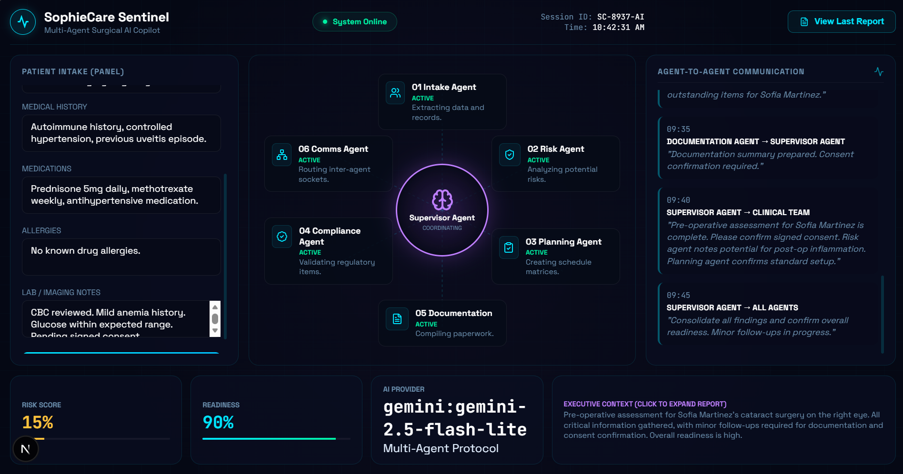

# SophieCare Sentinel



## Enterprise Multi-Agent Surgical Workflow Orchestration Platform

SophieCare Sentinel is a real-time multi-agent AI orchestration platform designed to demonstrate how specialized collaborative agents can coordinate complex surgical preparation workflows through shared context, agent-to-agent communication, and centralized supervision.

Built for the **Band of Agents Hackathon**, the platform showcases enterprise-grade orchestration patterns where autonomous AI agents analyze, exchange, validate, and synchronize clinical workflow information in real time.

> Educational prototype only.
> SophieCare Sentinel is not a medical device and must not be used for diagnosis, treatment, or real-world clinical decision-making.

---

# Overview

Modern surgical workflows often rely on fragmented systems, disconnected documentation, manual coordination, and time-sensitive preparation processes.

SophieCare Sentinel demonstrates how collaborative AI systems can:

* Coordinate specialized workflow agents
* Share structured context across agents
* Surface workflow-level risk signals
* Generate operational readiness plans
* Validate compliance and missing requirements
* Produce traceable documentation
* Visualize orchestration in real time

Instead of relying on a single monolithic AI model, SophieCare Sentinel distributes responsibilities across specialized agents coordinated by a central Supervisor Agent.

---

# Multi-Agent Architecture

## Supervisor Agent

Central orchestration layer responsible for:

* Coordinating all workflow agents
* Managing shared context
* Synchronizing workflow state
* Delegating tasks
* Aggregating outputs
* Resolving cross-agent dependencies

---

## Intake Agent

Responsible for:

* Extracting patient context
* Normalizing procedural information
* Structuring intake data
* Identifying relevant workflow inputs

---

## Risk Agent

Responsible for:

* Evaluating perioperative workflow risks
* Identifying medication conflicts
* Detecting risk escalation signals
* Generating workflow-level risk summaries

---

## Planning Agent

Responsible for:

* Building procedural readiness plans
* Generating operating-room preparation workflows
* Creating surgical checklists
* Coordinating preparation sequencing

---

## Compliance Agent

Responsible for:

* Validating workflow completeness
* Detecting missing approvals or documentation
* Verifying protocol readiness
* Ensuring traceability requirements

---

## Documentation Agent

Responsible for:

* Generating structured summaries
* Producing procedural documentation
* Drafting workflow reports
* Consolidating agent outputs

---

# Real-Time Orchestration

SophieCare Sentinel includes a real-time command center where users can visualize:

* Agent activation states
* Live communication between agents
* Workflow synchronization
* Shared context propagation
* Risk escalation events
* Dynamic orchestration activity

Example communication flow:

```txt
Intake Agent → Supervisor Agent
"Autoimmune history detected"

Supervisor Agent → Risk Agent
"Analyze immunosuppressive medication impact"

Risk Agent → Planning Agent
"Recommend additional inflammation monitoring"

Planning Agent → Documentation Agent
"Update procedural readiness checklist"
```

---

# Technical Stack

## Frontend

* Next.js App Router
* React
* TypeScript
* Custom enterprise orchestration UI
* Real-time orchestration visualization
* Futuristic AI command center design

## Backend

* Next.js API Routes
* Multi-agent orchestration pipeline
* Shared context management
* Provider abstraction layer

## AI Providers

* Gemini API
* Optional OpenRouter integration
* Optional Ollama local models
* Free mock orchestration mode

## Deployment

* Vercel-ready architecture
* Serverless-compatible API routes
* Environment-variable-based provider configuration

---

# Why Multi-Agent Systems?

Traditional AI applications often rely on a single generalized model.

SophieCare Sentinel demonstrates a distributed orchestration approach where:

* Specialized agents handle isolated responsibilities
* Context is exchanged dynamically
* Coordination occurs through a Supervisor Agent
* Outputs are aggregated collaboratively
* Workflow traceability becomes visible

This architecture improves:

* modularity,
* interpretability,
* workflow specialization,
* coordination transparency,
* enterprise scalability.

---

# Running Locally

## Installation

```bash
npm install
```

## Environment Setup

Create:

```bash
.env.local
```

Example:

```env
AI_PROVIDER=gemini
GEMINI_API_KEY=your_key_here
GEMINI_MODEL=gemini-1.5-flash
```

## Start Development Server

```bash
npm run dev
```

Open:

```bash
http://localhost:3000
```

---

# AI Provider Configuration

## Gemini (Recommended)

```env
AI_PROVIDER=gemini
GEMINI_API_KEY=your_key_here
GEMINI_MODEL=gemini-1.5-flash
```

Uses Google's Gemini API for real orchestration analysis.

---

## OpenRouter (Optional)

```env
AI_PROVIDER=openrouter
OPENROUTER_API_KEY=your_key_here
OPENROUTER_MODEL=meta-llama/llama-3.1-8b-instruct:free
```

---

## Ollama Local Models (Optional)

```env
AI_PROVIDER=ollama
OLLAMA_BASE_URL=http://localhost:11434
OLLAMA_MODEL=llama3.1:8b
```

Useful for local experimentation.

---

## Mock Mode

Runs entirely free without any external API.

```env
AI_PROVIDER=mock
```

---

# Deploying to Vercel

## 1. Push Repository to GitHub

```bash
git push origin main
```

---

## 2. Import Repository into Vercel

* Open Vercel
* Import GitHub repository
* Framework auto-detects as Next.js

---

## 3. Configure Environment Variables

Example:

```env
AI_PROVIDER=gemini
GEMINI_API_KEY=your_key_here
```

---

## 4. Deploy

Vercel automatically builds and deploys the application.

---

# Suggested Hackathon Submission

## Project Title

SophieCare Sentinel

---

## Short Description

Enterprise multi-agent surgical workflow orchestration platform where collaborative AI agents coordinate intake, risk analysis, planning, compliance validation, and documentation in real time.

---

## Long Description

SophieCare Sentinel is an enterprise-grade multi-agent orchestration platform designed to demonstrate how collaborative AI systems can coordinate complex surgical preparation workflows. Specialized agents exchange structured context, identify workflow-level risks, generate readiness plans, validate compliance requirements, and produce procedural documentation while a Supervisor Agent orchestrates the full workflow in real time. The platform visualizes agent-to-agent communication, orchestration activity, and workflow synchronization through a live AI command center interface.

---

# Hackathon Highlights

* Real-time multi-agent orchestration
* Agent-to-agent communication
* Shared contextual memory
* Enterprise AI workflow visualization
* Surgical workflow coordination
* Real AI provider integration
* Vercel-ready deployment
* Modern orchestration architecture

---

# Safety Disclaimer

SophieCare Sentinel is an educational workflow orchestration prototype created for hackathon demonstration purposes only.

The platform:

* does not provide medical diagnosis,
* does not replace professional clinical judgment,
* must not be used in real clinical environments,
* is not intended as a medical device.

Human clinical review is always required.

---

# License

MIT License
